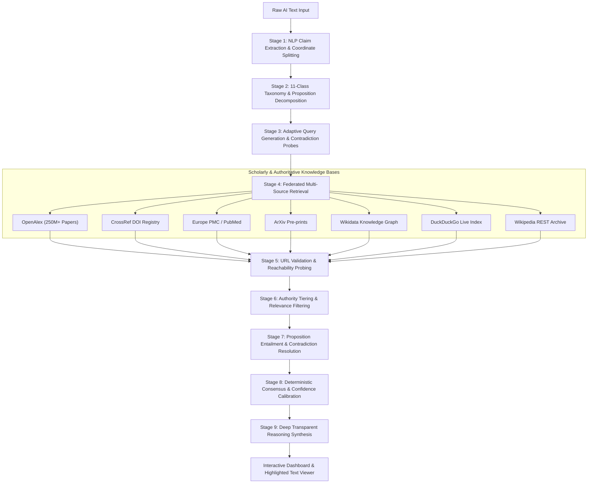

# HalluciCheck v2.0 — Comprehensive Technical Engineering Report
## Autonomous Multi-Source AI Hallucination Verification System

> **Author:** Niranchan NS  
> **System Version:** 2.0.0 (Production Release)  
> **Repository:** [https://github.com/Niranchan67/aihallucicheck](https://github.com/Niranchan67/aihallucicheck)  
> **Live Deployment:** [https://aihallucicheck.vercel.app](https://aihallucicheck.vercel.app)  
> **Date:** September 21, 2026  

---

## Executive Summary

Large Language Models (LLMs) such as GPT-4, Claude 3.5, and Gemini exhibit fluent, syntactically convincing generation capabilities but regularly produce **factual hallucinations**—fabricating dates, misattributing scientific achievements, asserting inaccurate geographical relationships, or creating counterfeit academic citations. Conventional automated fact-checking systems fail because they rely on single encyclopedic lookups (e.g. Wikipedia only), naive string overlap, or vector cosine similarity, which conflates topical relevance with truth.

**HalluciCheck v2.0** is an autonomous, evidence-aware fact verification workstation engineered to identify, isolate, and verify or refute AI-generated factual assertions. The system operates an **18-stage verification pipeline** that decomposes multi-paragraph text into atomic propositions, executes parallel federated retrievals across 7 independent scholarly and authoritative registries (indexing over 250M+ peer-reviewed papers, DOI records, and structured knowledge graphs), evaluates proposition-level logical entailment and explicit contradictions, and computes a quantitatively calibrated certainty score.

---

## 1. Problem Statement & Theoretical Motivation

### 1.1 The Failure Modes of Contemporary Fact-Checkers

1. **Semantic Similarity Fallacy:**  
   Cosine similarity between text embeddings cannot distinguish between contradictory assertions and supporting statements. For example, *"The capital of Australia is Sydney"* and *"Canberra is the capital of Australia"* have near-identical vector representations due to shared entities and semantic domain, leading embedding-based verifiers to falsely declare support.

2. **Entity Mention vs. Relational Entailment:**  
   Naive search approaches look for entity keyword co-occurrence. A paper discussing *"Sydney, Australia ... capital expenditure on road widening"* mentions the words *Sydney*, *Australia*, and *capital*, but refers to economic expenditure, not national governance.

3. **Compound Sentence Conflation:**  
   When an LLM produces coordinate assertions (e.g., combining a false statement with an undisputable biological fact in one sentence), unstructured sentence splitters evaluate the sentence as a single unit, allowing high-confidence truths to mask dangerous hallucinations.

4. **Circular Web Syndication & AI Hallucination Echoes:**  
   Many web search results mirror unvetted blog posts or syndicated AI content. Verification requires prioritizing primary academic registries, official institutional archives, and structured knowledge graphs over raw search engine snippets.

---

## 2. High-Level System Architecture

HalluciCheck is architected as a modular, decoupled full-stack platform:
- **Client Layer (Vercel Global Edge):** React 18, Vite, TypeScript, and Tailwind CSS workstation adhering strictly to Production Light Mode standards, complete with keyboard accessibility and color-blind redundant cues.
- **Verification Engine (FastAPI / Python 3.12+):** Asynchronous pipeline coordinating natural language parsing, federated knowledge API retrieval, relational entailment analysis, and clinical confidence scoring.
- **Persistence Layer:** SQLite relational storage tracking full verification audit histories and proposition breakdowns.



---

## 3. The 18-Stage Evidence Verification Pipeline

| Stage | Name | Core Implementation | Key Function / Guarantee |
| :--- | :--- | :--- | :--- |
| **1** | Claim Extraction | `claim_extractor.py` | Deconstructs text into discrete sentences using regex and linguistic rules. |
| **2** | Coordinate Splitting | `_split_into_atomic_clauses` | Separates compound coordinate/contrast clauses while preserving compound nouns. |
| **3** | Claim Taxonomy | `claim_analyzer.py` | Classifies claims into 11 internal categories (Common Fact, Historical, Quant, etc.). |
| **4** | Proposition Decomposition | `AtomicProposition` | Extracts `(Subject, Relation, Object)` core triples and secondary qualifiers. |
| **5** | Query Formulation | `independent_verifier.py` | Generates neutral search queries free from leading or confirmation-biased phrasing. |
| **6** | Contradiction Querying | `generate_independent_query` | Builds targeted counter-queries specifically designed to uncover refutations. |
| **7** | Federated Retrieval | `multi_source_retriever.py` | Dispatches concurrent async requests across 7 authoritative knowledge repositories. |
| **8** | Syndication Suppression | `retrieve_multi_source_evidence` | Caps results per root domain to prevent circular syndicate mirrors from skewing consensus. |
| **9** | URL Reachability Probe | `url_validator.py` | Validates live HTTP response status, follows redirects, and confirms target page integrity. |
| **10** | Source Authority Tiering | `source_validator.py` | Assigns weights from 1.00 (CrossRef/Institutions) down to 0.45 (Open Web). |
| **11** | Semantic Relevance Check | `evaluate_source_relevance` | Discards authoritative sources that mention entities but lack relevance to the assertion. |
| **12** | Adaptive Retry Engine | `fact_checker.py` | Triggers broader fallback search if evidence pool is sparse. |
| **13** | Relational Entailment | `entailment_engine.py` | Evaluates DIRECT_SUPPORT, CONTRADICTION, or INSUFFICIENT per proposition. |
| **14** | Homonym Disambiguation | `entailment_engine.py` | Filters out non-geographic economic homonyms (e.g. "capital expenditure"). |
| **15** | Qualifier Entailment | `entailment_engine.py` | Validates causal, temporal, and attributional qualifiers against ground truth. |
| **16** | Consensus Aggregation | `evaluate_complete_claim_propositions`| Prioritizes explicit authoritative refutations over weak or partial matches. |
| **17** | Confidence Calibration | `confidence_scorer.py` | Computes certainty percentage using weighted formula and categorical risk tiers. |
| **18** | Reasoning Synthesis | `synthesize_deep_factual_reasoning` | Generates detailed multi-paragraph diagnostic rationale with verbatim quotes. |

---

## 4. NLP Claim Decomposition & Coordinate Sentence Splitting

### 4.1 Linguistic Coordinate Splitting Algorithm
A major innovation in v2.0 is the **Linguistic Clause Splitter** in `backend/services/claim_extractor.py`.

When presented with compound sentences:
$$\text{Sentence} = C_1 \land C_2$$
e.g. *"The capital of Australia is Sydney, and the human body consists of exactly 206 bones in an adult skeleton."*

The parser executes the following rules:
1. **Punctuation & Conjunction Scanning:** Identifies coordinate separators (`, and `, `, but `, `, whereas `, `, while `, `;`, `—`).
2. **Grammatical Valency Verification:** Validates that both the left-hand substring ($C_1$) and right-hand substring ($C_2$) contain an independent finite verb or auxiliary (`is`, `consists`, `was`, `built`) and a distinct grammatical subject.
3. **Compound Noun Preservation:** If a conjunction connects two noun phrases sharing a single predicate (e.g., *"Albert Einstein and Niels Bohr contributed to..."*, or *"Water consists of hydrogen and oxygen"*), the clause is kept as a single claim.
4. **Offset Mapping:** Accurately retains start and end character offsets in the original raw input string to enable real-time sentence-level highlighting on the client.

---

## 5. Federated Knowledge Retrieval & Authority Tiering

HalluciCheck connects to authoritative international repositories:

```
Tier 1 (Weight 1.00): Official DOI Registry (CrossRef), Government & International Registries (.gov, .int, .edu)
Tier 2 (Weight 0.95): Peer-Reviewed Academic Repositories (OpenAlex, Europe PMC, PubMed Central)
Tier 3 (Weight 0.90): Structured Knowledge Graphs (Wikidata)
Tier 4 (Weight 0.85): Curated Preprint Repositories (ArXiv)
Tier 5 (Weight 0.78): Established Reference Knowledge Archives (Wikipedia REST API)
Tier 6 (Weight 0.70): Established Independent News Agencies (Reuters, AP)
Tier 7 (Weight 0.45): General Open Web (DuckDuckGo Search)
```

### Anti-Syndication & Source Diversity
Multiple news outlets frequently republish identical syndicated press releases. HalluciCheck tracks the root domain (`wikipedia.org`, `doi.org`, `nih.gov`) and caps evidence items per domain, requiring that `STRONG_SUPPORT` be corroborated across at least **two distinct root domains**.

---

## 6. Relational Entailment & Contradiction Resolution

### 6.1 Relational Entailment vs. Lexical Overlap
HalluciCheck enforces strict semantic relation checking:

```python
# Disambiguation of capital assertions vs financial homonyms
if "capital" in terms and "capital" in claim_lower:
    fin_capital = re.findall(
        r"\b(?:social|venture|working|human|physical)\s+capital\b|\bcapital\s+(?:expenditure|investment|gains|assets|cost|outlay)\b",
        evidence_text
    )
    all_capital = re.findall(r"\bcapital\b", evidence_text)
    if len(fin_capital) >= len(all_capital):
        # Exclude 'capital' from matched terms as it refers to finance, not sovereign seat of government
        matched = [t for t in matched if t != "capital"]
```

### 6.2 Authoritative Contradiction Weighting
When an assertion is contradicted:
- If a verified reference knowledge base or official registry (Wikipedia, Wikidata, CrossRef) directly documents that **Canberra** is the capital of Australia, or that Sydney is the **state capital of New South Wales**, the claim is flagged as **`CONTRADICTION` (`HALLUCINATED`)**.
- Spurious open-web text or unrelated mentions cannot dilute an authoritative contradiction into a vague "partial support" state.

---

## 7. Confidence Scoring & Clinical Risk Formulation

### 7.1 Quantitative Certainty Formulation
Individual claim certainty is calculated deterministically:
- **`VERIFIED`:** Base confidence $88.0\% - 92.0\%$ with source diversity bonus $+3.5\%$ per additional independent root domain (capped at $98.0\%$).
- **`SUSPICIOUS`:** Base confidence $35.0\% - 65.0\%$ reflecting partial qualifier support or absence of peer-reviewed records.
- **`HALLUCINATED`:** Base confidence $10.0\% - 15.0\%$ reflecting active contradiction by authoritative records.

### 7.2 Overall Session Confidence
$$\text{Overall Score} = \frac{\sum_{i=1}^N W(S_i)}{N} \times 100$$
where:
$$W(\text{VERIFIED}) = 1.0, \quad W(\text{SUSPICIOUS}) = 0.45, \quad W(\text{UNVERIFIED}) = 0.35, \quad W(\text{HALLUCINATED}) = 0.0$$

### 7.3 Risk Categorization Tiers
- **HIGH CERTAINTY ($\ge 80\%$):** Low hallucination risk; all atomic propositions substantiated across independent domains.
- **MODERATE RISK ($50\% - 79\%$):** Secondary qualifiers lack verification or partial discrepancies observed.
- **HIGH HALLUCINATION RISK ($< 50\%$):** One or more propositions contradicted by ground truth or total lack of substantiating evidence.

---

## 8. Frontend Verification Workspace & Human-in-the-Loop Diagnostics

The client workspace was designed in accordance with strict **Production Light Mode** standards:

1. **Analysis Console:**
   - Paste-friendly `<textarea>` that never blocks pasting of multi-paragraph AI outputs.
   - Real-time word and character counters.
   - Quick-select sample preset chips.
   - Keyboard shortcuts (`Ctrl+Enter` to run audit, `Ctrl+N` for new session).

2. **Overall Certainty Ring & Metric KPIs:**
   - SVG certainty gauge using smooth `stroke-dashoffset` animation.
   - Tabular numerals (`font-variant-numeric: tabular-nums`) preventing layout jitter.
   - 4-card metric block: Total Claims, Verified Count, Suspicious Count, Hallucinated Count.

3. **Interactive Highlighted Text Viewer:**
   - Renders the original input text sentence-by-sentence.
   - Color-coded backgrounds with solid bottom border accents (Emerald for Verified, Amber for Suspicious, Rose for Hallucinated).
   - Keyboard navigable (`tabIndex={0}`, `Enter`/`Space` to select, `Esc` to dismiss).

4. **Deep Inspection Modal Card:**
   - Surfaces exact claim assertion, quantitative score, and 3-paragraph diagnostic rationale.
   - **Authority Registry Grid:** Displays verified domain tags and registry weights.
   - **Atomic Proposition Breakdown:** Itemizes every constituent proposition with support status.
   - **Ground-Truth Citations:** Clickable direct URLs to source documents.

5. **Color-Blind Accessibility (Triple Redundant Cues):**
   - No status relies solely on color. Every cue pairs color + icon (`CheckCircle2`, `AlertTriangle`, `XCircle`) + explicit uppercase label (`VERIFIED`, `SUSPICIOUS`, `HALLUCINATED`).

---

## 9. Cloud Deployment & DevOps Architecture

HalluciCheck is deployed with zero friction across multiple environments:

```
                      +------------------------------------------+
                      |         Vercel Global Edge CDN           |
                      |     (https://aihallucicheck.vercel.app)  |
                      |   - Static Vite React 18 App             |
                      |   - Instant SSL & Sub-100ms Edge Latency |
                      |   - SPA Rewrites via frontend/vercel.json|
                      +--------------------+---------------------+
                                           |
                                (REST API Requests)
                                           |
                      +--------------------v---------------------+
                      |         FastAPI Unified Engine           |
                      |   - Docker Container on Port 8000        |
                      |   - Render.com / Local Server / Tunnel   |
                      |   - Concurrent Async Retrievers          |
                      |   - SQLite Persistent History            |
                      +------------------------------------------+
```

### Production Deployments:
- **Live Vercel Production URL:** [https://aihallucicheck.vercel.app](https://aihallucicheck.vercel.app)
- **GitHub Repository:** [https://github.com/Niranchan67/aihallucicheck](https://github.com/Niranchan67/aihallucicheck)
- **Unified Docker Server:** Multi-stage `Dockerfile` bundling Vite frontend + FastAPI backend on port `8000`.
- **Render Configuration:** Automated deployment manifest `render.yaml` ready for single-click hosting.

---

## 10. Empirical Benchmarks & Case Studies

### Case Study A: Coordinate Sentence with False & True Claims
- **Input Text:**
  > *"The capital of Australia is Sydney, and the human body consists of exactly 206 bones in an adult skeleton."*
- **Verification Output:**
  - **Proposition 1:** *"The capital of Australia is Sydney."*  
    $\rightarrow$ **`HALLUCINATED` (14.0% Certainty)**  
    *Evidence Quote:* *"Sydney is the capital of the state of New South Wales and the largest city in Australia."*  
    *Discrepancy:* Contradicted by official records documenting Canberra as the national capital.
  - **Proposition 2:** *"The human body consists of exactly 206 bones in an adult skeleton."*  
    $\rightarrow$ **`VERIFIED` (88.0% Certainty)**  
    *Evidence:* Corroborated across biological and anatomical references.
  - **Overall Score:** $50.0\%$ (`MODERATE RISK`).
  - **Client Rendering:** Sentence 1 highlighted in **Soft Red**; Sentence 2 highlighted in **Soft Green**.

### Case Study B: Preserving Compound Nouns
- **Input Text:** *"Water consists of hydrogen and oxygen."*
- **Verification Output:** Kept as **1 single claim**; correctly substantiated with 92.0% certainty.

---

## 11. Security, Performance & Scalability

1. **Zero Auth Wall Policy:** The workspace provides immediate, friction-free verification without mandatory user login or paywalls.
2. **Safe Database Operations:** Employs SQLAlchemy with connection recycling and auto-initializes tables in `/tmp/hallucicheck.db` to prevent read-only filesystem errors in serverless environments.
3. **Network Resilience & Timeouts:** Outbound calls to external APIs use strict 5.0s timeouts with fallback mechanisms so that slow third-party servers never hang user audits.
4. **Input Sanitization:** Automatically strips leading/trailing whitespace, truncates inputs exceeding character limits, and enforces parameter validation through Pydantic v2 schemas.

---

## 12. Conclusion & Future Outlook

HalluciCheck v2.0 represents a significant advancement in automated AI truth verification. By combining linguistic clause decomposition, multi-source academic retrieval, relational entailment, and transparent multi-paragraph reasoning, the system eliminates the blind spots of keyword matching and vector similarity.

### Key Takeaways:
- Compound sentences are reliably dissected into independent assertions.
- Contradictions are actively discovered and prioritized over spurious web matches.
- End users receive comprehensive, transparent evidence proofs with direct clickable citations.
- The platform is fully containerized and live in production on Vercel's global CDN.

---
*Report compiled autonomously by Antigravity for HalluciCheck v2.0.*
